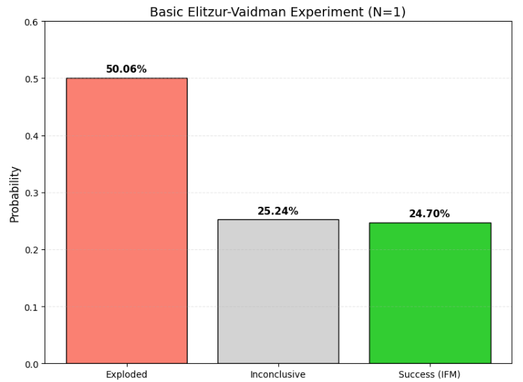
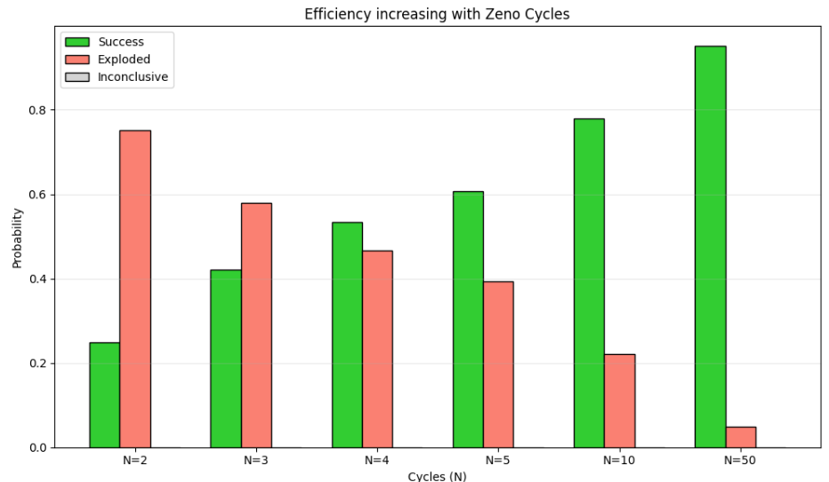

# The Elitzur-Vaidman Bomb Tester

This repository contains quantum simulations and experimental proposals investigating Interaction-Free Measurement (IFM) through the Elitzur Vaidman (EV) Bomb Testing Problem.

The project demonstrates how quantum mechanics specifically superposition and the Quantum Zeno effect can be used to detect the presence of an object without physically interacting with it, a feat impossible in classical physics.

## Structure

The codebase is organized into four primary Python scripts, each analyzing a different aspect of the experiment:

### 1. `single_iteration.py`

* **Function:** Simulates the standard single-cycle Mach-Zehnder interferometer ().
* **Logic:** Uses Hadamard and CNOT gates to model the constructive/destructive interference disruption caused by a "bomb."
* **Output:** Generates a statistical report and a histogram visualizing the three potential outcomes: Explosion (~50%), Inconclusive (~25%), and Interaction-Free Success (~25%).

### 2. `multi_iteration.py`

* **Function:** Implements the high-efficiency protocol using repeated weak measurements (Quantum Zeno Effect).
* **Logic:** Performs a parameter sweep over various cycle counts (). It utilizes small angle rotations () to "freeze" the quantum state if a bomb is present.
* **Output:** Produces a grouped bar chart demonstrating how the Success rate approaches 100% (and Explosion rate approaches 0%) as  increases.

### 3. `compare_plots.py`

* **Function:** Visualizes the theoretical limits of the protocol.
* **Logic:** Plots the exact efficiency function for the iterative protocol:

* **Output:** Generates a clean efficiency trend line graph (`efficiency_curve.png`), providing a theoretical baseline to compare against the stochastic simulation data.

### 4. `circuit_visualize.py`

* **Function:** Circuit schematic generator.
* **Logic:** Utilizes Qiskit's draw() module to build the quantum circuit representation.
* **Output:** Renders ASCII/Text diagrams for both the Basic (Interferometer) and Iterative (Zeno) setups to visualize the gate logic.

---

## Simulation Results

Below are the graphical outputs generated by the simulations, demonstrating the transition from probabilistic detection to deterministic measurement.

### 1. Basic Setup (Single Iteration)

This histogram represents the outcomes of the classic Elitzur Vaidman experiment (). As predicted by theory, 50% of the trials result in an explosion. The remaining 50% are split evenly between "Inconclusive" (no bomb detected) and "Success" (bomb detected without interaction), yielding a maximum efficiency of only 25%.

### 2. High-Efficiency Zeno Sweep

This grouped bar chart illustrates the power of the Quantum Zeno Effect. As we increase the number of measurement cycles (), the probability of "Success" (Green) rises dramatically, while the probability of "Explosion" (Red) and "Inconclusive" results (Gray) drops to near zero. At , the success rate exceeds 95%.

### 3. Theoretical Efficiency Limit

This trend line plots the theoretical limit of Interaction-Free Measurement efficiency using the exact solution. The curve shows that efficiency scales non-linearly with the number of cycles, asymptotically approaching 100%. This serves as the ideal baseline against which our stochastic quantum simulations are validated.

---

## Theoretical Background

### The Paradox

The Elitzur-Vaidman problem proposes a scenario where a "bomb" is triggered by the absorption of a single photon. The goal is to verify the bomb is active without detonating it. Classical physics requires interaction for detection (causing an explosion), but quantum mechanics allows for detection via wave-particle duality.

### Method 1: Basic Interferometer

By placing the bomb in one arm of a Mach-Zehnder interferometer, the bomb disrupts the constructive interference of the photon. This "path information" allows us to infer the bomb's presence if the photon lands in the "dark port" detector.

### Method 2: Quantum Zeno Effect (Iterative)

By rotating the photon's polarization in tiny increments and checking for the bomb after each step, the act of measurement "freezes" the quantum state. If the bomb is present, the photon remains in its initial state; if absent, it rotates fully. This allows for detection probabilities approaching 100%.

---

## Applications

Interaction-free measurement is not just a theoretical paradox; it has paved the way for groundbreaking technologies in quantum sensing and imaging:

* **Quantum Imaging (Interaction-Free Microscopy):** Imaging extremely sensitive samples (e.g., photosensitive proteins) without exposing them to photons that could damage them.
* **Counterfactual Quantum Key Distribution (QKD):** Generating a shared encryption key between two parties without physically sending particles across the channel, securing it against eavesdropping.
* **Optical Component Testing:** Testing the functionality of ultra-sensitive photodetectors without triggering or saturating them.

---

## 🧪 Experimental Proposal

In addition to the software simulation, this project proposes a physical analog design using:

* **Source:** Helium-Neon (He-Ne) Laser.
* **Components:** 50/50 Beam Splitters and Mirrors.
* **Detection:** Observation of interference fringe visibility on a screen.
* **The "Bomb":** An opaque object blocking one path to demonstrate the loss of interference.

1. **When the bomb (object) is present:** It blocks one path completely, destroying the superposition. Light reaches the screen along the unobstructed path only. No fringes are visible; instead, a uniform solid spot is observed.
2. **When the bomb (object) is absent:** Laser light travels through both paths. Interference fringes are visible (distinct bright and dark regions).

*Note: This experiment is a classical wave-optics analogy. True interaction-free measurement requires single-photon sources.*
